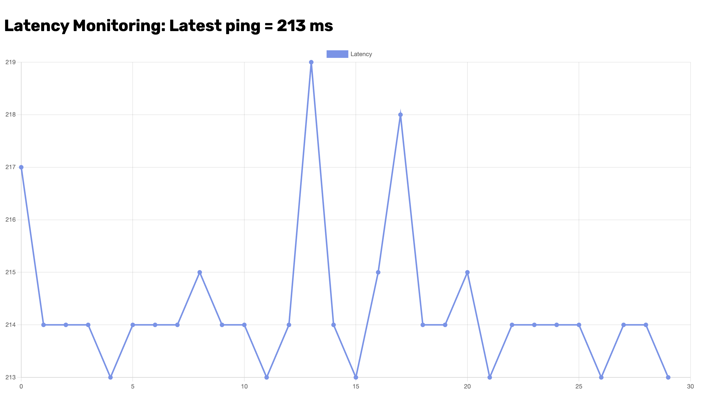

# Python Web Server for Latency Monitoring
Monitor any latency for running ping command.



## Install Python3
You can download Python 3 from the [Python Official Website](https://www.python.org/downloads/) and install it on your computer.

## Install TMUX (Optional)
If you are a Linux user, you can install Tmux for managing multi-session terminals in the background. This will allow you to run a Python web server and execute the ping command simultaneously.

```bash
sudo apt-get install tmux
```

## Clone this project
- Open your terminal, clone this project into your computer.
- Change directory to 'python-web-latency-monitoring'

```bash
git clone https://github.com/haikal-dev/python-web-latency-monitoring.git
cd python-web-latency-monitoring
```

## Install Flask module on Python3 (Required)
This will allow you to run a Python web server. In your project directory, open the terminal and type the following command:

```bash
pip install Flask
```

## Option 1: Start Monitoring (For Linux user)
You can run two commands in the background using Tmux. To do this, open the terminal in your project directory and type the following command:

```bash
tmux new -d -s ping 'ping 8.8.8.8 > ping.txt'
tmux new -d -s server 'python3 app.py'
```

Open your browser, simply type URL: 

```bash
http://localhost:5000
```

## Option 2: Start Monitoring (For Windows user)
Open two command prompts separately. In each command prompt, navigate to your project directory.

```bash
cd <project-directory-path>
```

On first command prompt, run ping command.

```bash
ping 8.8.8.8 > ping.txt
```

On second command prompt, run python web server.

```bash
python3 app.py
```

While both terminals are running, you can open the browser and type the URL:

```
http://localhost:5000
```

**You can also press 'F' for full screen.**